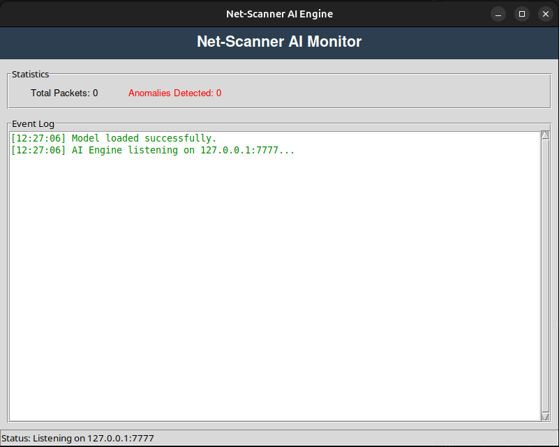

# NET-SCANNER

A network security tool that monitors ARP traffic to detect anomalous behavior and potential attacks. Designed primarily for Linux OS.

---

## Quick Start

### 1. Build the Project

```bash
make
```

### 2. Find Your Network Interface

```bash
ip a
```

Typically `eth0` for Ethernet or `wlo1` for WiFi.

### 3. Create the Whitelist

Choose one of the following methods:

**Option A: Active Scanning (Recommended - Fast)**
```bash
sudo ./app <network_interface> --scan
```
Uses `arp-scan` to immediately discover all devices on your network.

**Option B: Passive Learning (Slower)**
```bash
sudo ./app <network_interface> --learn
```
Waits for ARP traffic and builds the whitelist as devices are detected.

**Option C: Combined (Best of Both)**
```bash
sudo ./app <network_interface> --scan --learn
```
- **First**: Performs active scan to discover all current devices
- **Then**: Continues in learning mode to add new devices that join later

### 4. Run the Scanner

Once you have a whitelist, run in one of these modes:

**Standard Mode:**
```bash
sudo ./app <network_interface>
```
Detects unauthorized MAC addresses by comparing against the whitelist.

**AI-Driven Mode:**
```bash
# Terminal 1: Start the AI engine
python3 model/ai-engine.py

# Terminal 2: Start the scanner
sudo ./app <network_interface> -ia
```
Detects unknown MAC addresses, ARP flooding, network scans, and MITM attacks.

---

## Operating Modes

### Standard Mode
Simple comparison between detected MAC addresses and the whitelist. Alerts on any unknown devices.

**Limitations**: Only detects unauthorized MAC addresses, not sophisticated attacks.

### AI-Driven Mode
Uses machine learning to detect:
- Unknown MAC addresses
- ARP flooding attacks
- Network scanning (e.g., nmap)
- Man-in-the-Middle (MITM) attacks

**Requirement**: Must train the model first (see below).

---

## Training the AI Model

> **Important**: Train the model only with trusted devices to avoid false negatives.

### Step 1: Generate Whitelist
```bash
sudo ./app <network_interface> --scan --learn
```
Let it run until all trusted devices are detected. You can also manually add MAC addresses to `whitelist.txt`.

### Step 2: Collect Traffic Data
```bash
# Terminal 1: Start data collector
python3 model/collector.py

# Terminal 2: Run scanner in AI mode
sudo ./app <network_interface> -ia
```
Let it collect data for as long as possible (longer = better model).

### Step 3: Train the Model
```bash
python3 model/trainer.py
```
This creates a `.pkl` model file.

### Step 4: Start Detection
```bash
# Terminal 1
python3 model/ai-engine.py

# Terminal 2
sudo ./app <network_interface> -ia
```

---

## Command-Line Flags Summary

| Flag | Description |
|------|-------------|
| `--scan` | Actively scan network to discover devices (uses arp-scan) |
| `--learn` | Passively learn new devices from ARP traffic |
| `-ia` | Run in AI mode (requires ai-engine.py running) |

Flags can be combined: `--scan --learn`, `--scan -ia`, etc.

---

## Screenshot



---

## Disclaimer

*This is a learning project and not a production-ready security tool. There may be errors or limitations. Feedback welcome!*
